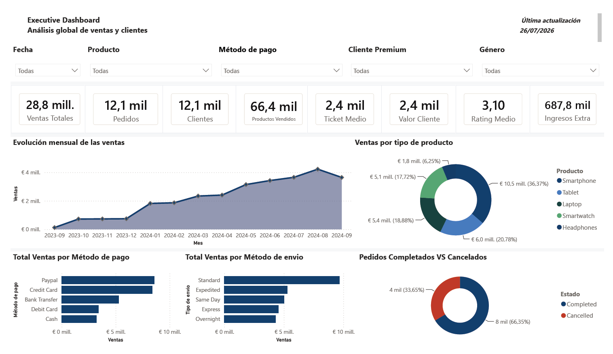
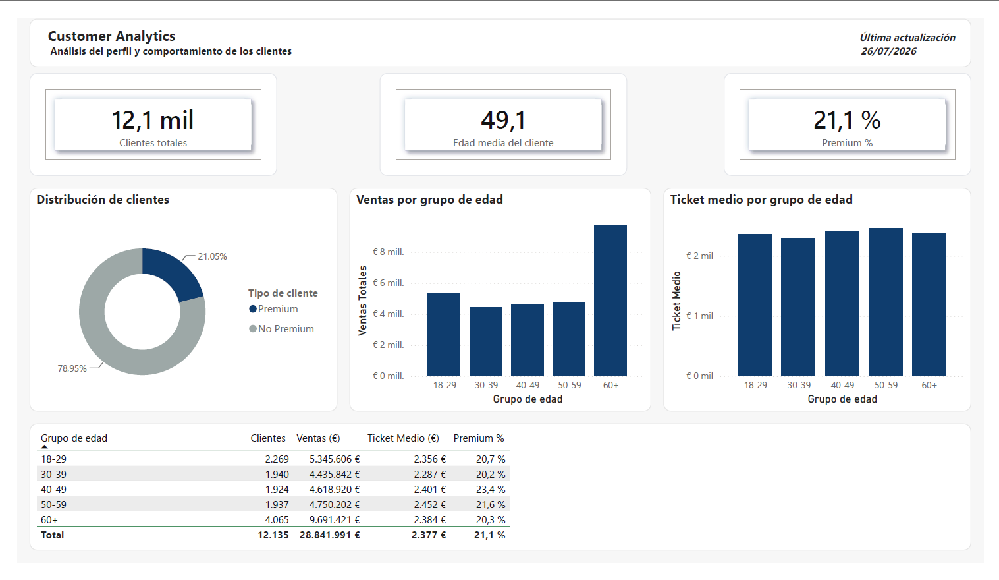
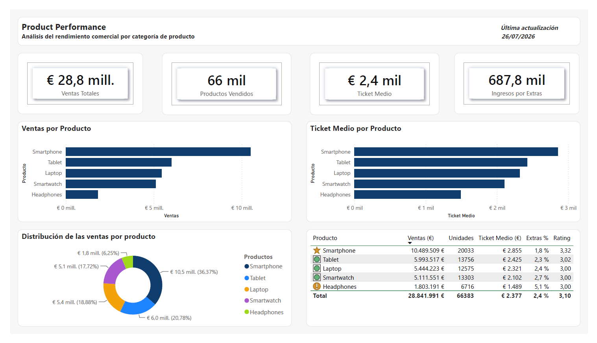
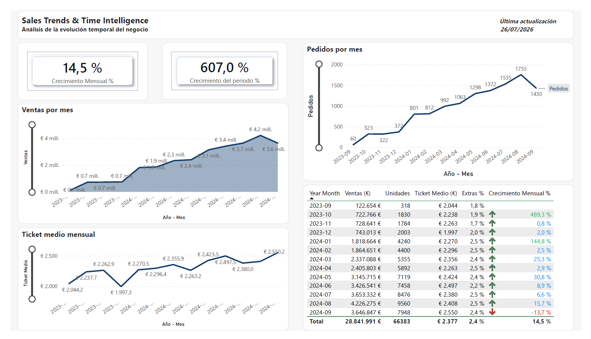
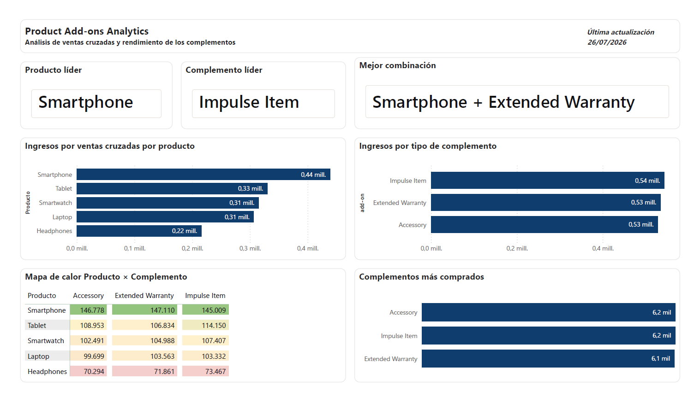

# NovoTech Sales Analytics

> End-to-end Business Intelligence project analyzing sales performance, customer behavior and product analytics using MySQL, SQL, Python and Power BI.



## 📖 Introduction

NovoTech is a fictional consumer electronics retailer operating through both physical stores and an online sales channel.

To support data-driven decision making, the company requires a complete analysis of its sales performance, customer behavior, product performance and operational processes.

This project develops an end-to-end Business Intelligence solution that transforms transactional sales data into actionable insights through SQL analysis and interactive Power BI dashboards.

## 🎯 Project Objective

The objective of this project is to design and develop a complete Business Intelligence solution capable of transforming transactional sales data into meaningful business insights.

The project covers the entire analytics workflow, including data preparation with Python, relational database design in MySQL, business-oriented SQL analysis and the development of interactive Power BI dashboards to support commercial decision-making.

## 🛠️ Technologies Used

| Category | Technologies |
|----------|--------------|
| Programming | Python |
| Data Analysis | Pandas |
| Database | MySQL |
| Query Language | SQL |
| Business Intelligence | Power BI |
| Version Control | Git |
| Repository | GitHub |

## 📁 Project Structure

```text
NOVOTECH-SALES-ANALYTICS
│
├── dashboard/
│   ├── images/
│   ├── novotech-sales-analytics.pbix
│   └── novotech-sales-analytics-report.pdf
│
├── data/
│   ├── raw/
│   ├── processed/
│   └── sql/
│
├── docs/
├── notebooks/
├── sql/
│
├── DATABASE_DESIGN.md
├── PROJECT_PLAN.md
├── README.md
└── requirements.txt
```

## 🔄 Project Workflow

The project follows a complete Business Intelligence workflow, from raw transactional data to business insights.

```text
Raw Dataset
      │
      ▼
Data Preparation (Python)
      │
      ▼
Relational Database (MySQL)
      │
      ▼
Business Analysis (SQL)
      │
      ▼
Interactive Dashboard (Power BI)
      │
      ▼
Business Insights & Recommendations
```

## 📊 Power BI Dashboards

The Business Intelligence solution is organized into five interactive dashboards, each designed to answer a specific business question and support decision-making from different perspectives.

### Executive Dashboard


**Objective**

Provide a high-level overview of the company's sales performance through key business metrics, sales trends and operational indicators.

**Key Business Questions**

- How is the business performing overall?
- What are the main sales channels and product categories?
- How have sales evolved over time?
- What is the current operational status of customer orders?

### Customer Analytics



**Objective**

Analyze customer demographics and purchasing behavior to identify key customer segments and commercial opportunities.

**Key Business Questions**

- What is the customer demographic profile?
- How do different age groups contribute to sales?
- What proportion of customers are loyalty members?
- Which customer segments generate the highest average order value?

### Product Performance



**Objective**

Evaluate product performance by comparing sales, average ticket, customer ratings and additional revenue generated across product categories.

**Key Business Questions**

- Which products generate the highest revenue?
- Which products achieve the highest average ticket?
- How do customer ratings vary across products?
- Which categories generate the highest additional revenue?

### Sales Trends & Time Intelligence



**Objective**

Monitor business evolution over time through sales trends, monthly growth and key performance indicators.

**Key Business Questions**

- How have sales evolved over the analysis period?
- How has the average ticket changed over time?
- What is the monthly sales growth?
- How has order volume evolved each month?

### Product Add-ons Analytics



**Objective**

Analyze add-on performance to identify complementary products that generate additional revenue and strengthen commercial opportunities.

**Key Business Questions**

- Which add-ons generate the highest revenue?
- Which products sell the most add-ons?
- What are the most successful product and add-on combinations?
- How are add-on sales distributed across product categories?

## 💡 Key Business Insights

The analysis identified several valuable insights that can support strategic decision-making across different business areas.

- **Sales Performance:** Smartphones generated the highest revenue, representing more than one-third of total sales.

- **Customer Analytics:** Loyalty members accounted for approximately 21% of customers, while maintaining a balanced distribution across age groups.

- **Product Performance:** Headphones generated the highest percentage of additional revenue through complementary purchases.

- **Sales Trends:** Sales showed an overall positive trend throughout the analysis period, with sustained monthly growth despite normal seasonal fluctuations.

- **Product Add-ons:** Complementary products generated significant additional revenue, with clear opportunities to strengthen add-on sales across product categories.

## 📚 Additional Documentation

The repository also includes additional technical documentation describing the project planning and relational database design.

- 📄 `PROJECT_PLAN.md`
- 📄 `DATABASE_DESIGN.md`

These documents provide further details about the business objectives, database structure and project methodology.

## 👤 Author

**Isabelo Castillo**

Aspiring Data Analyst passionate about Business Intelligence, SQL, Python and Power BI.

GitHub: https://github.com/IsabeloCastillo
